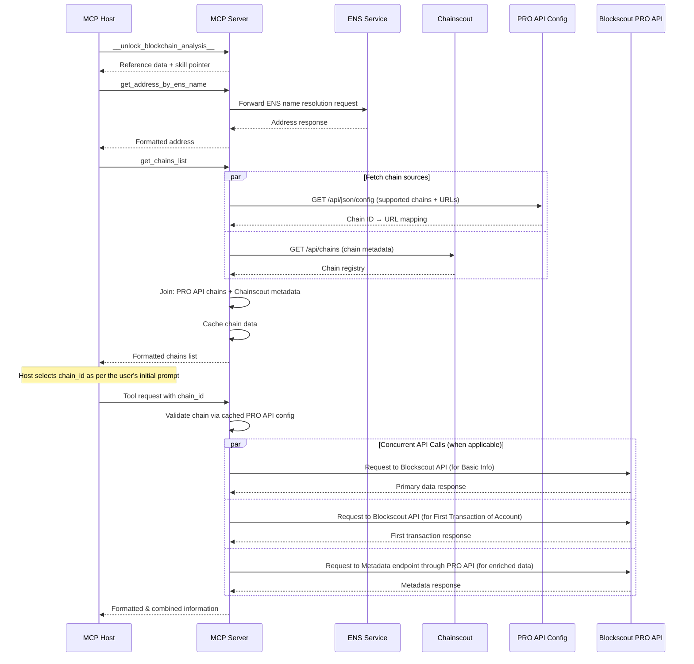
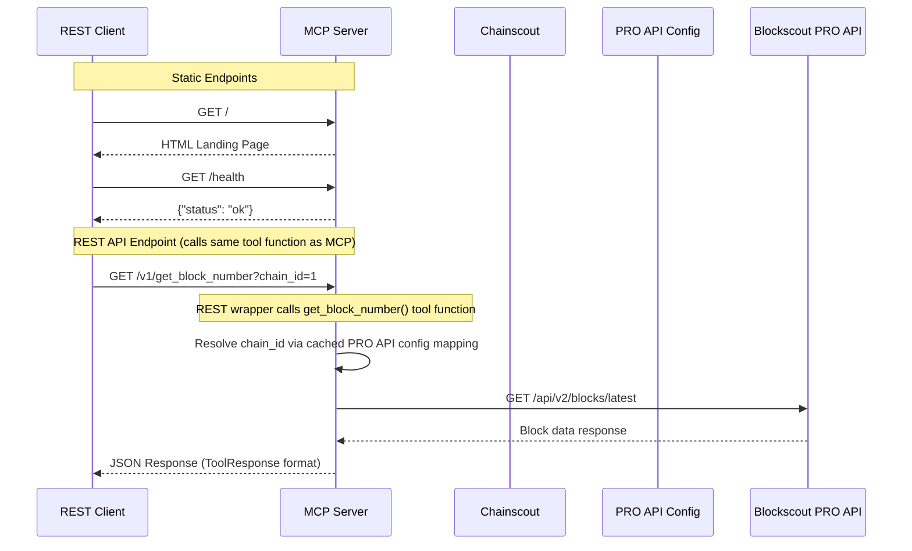
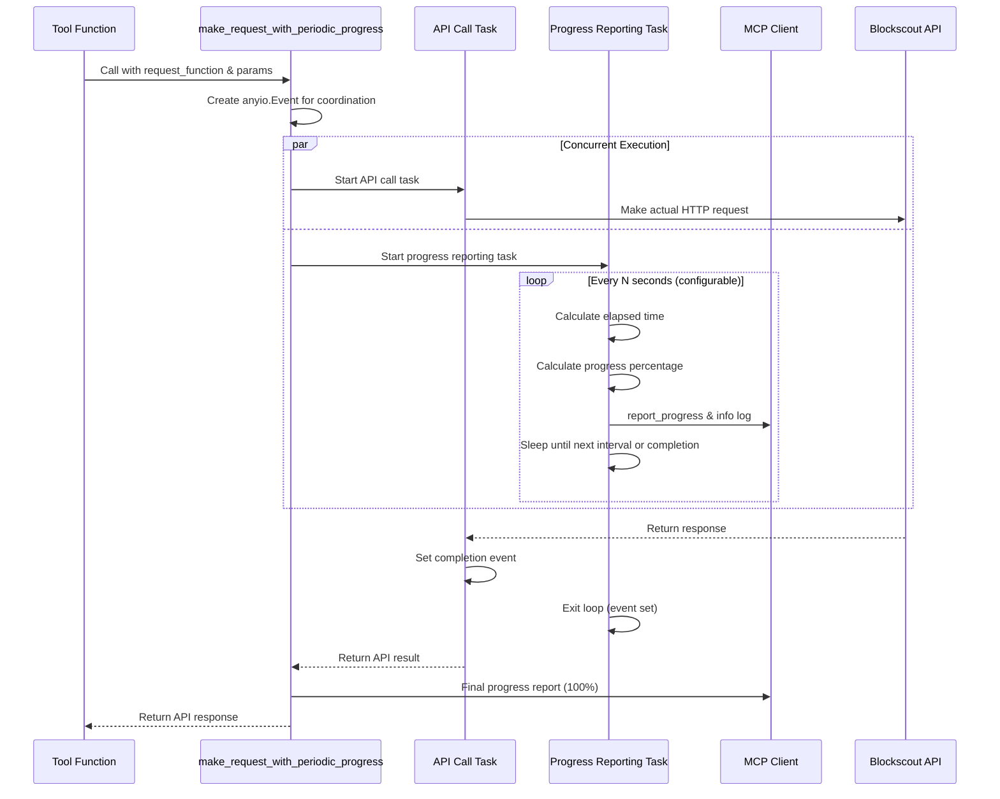

# Blockscout MCP Server

This server wraps Blockscout APIs and exposes blockchain data—balances, tokens, NFTs, contract metadata—via MCP so that AI agents and tools (like Claude, Cursor, or IDEs) can access and analyze it contextually.

## Technical details

- The server is built using [MCP Python SDK](https://github.com/modelcontextprotocol/python-sdk) and Httpx.

### Operational Modes

The Blockscout MCP Server supports two primary operational modes:

1. **Stdio Mode (Default)**:
   - Designed for integration with MCP hosts/clients (Claude Desktop, Cursor, MCP Inspector, etc.)
   - Uses stdin/stdout communication following the MCP JSON-RPC 2.0 protocol
   - Automatically spawned and managed by MCP clients
   - Provides session-based interaction with progress tracking and context management

2. **HTTP Mode**:
   - Enabled with the `--http` flag.
   - By default, this mode provides a pure MCP-over-HTTP endpoint at `/mcp`, using the same JSON-RPC 2.0 protocol as stdio mode.
   - While it is stateless and streams Server‑Sent Events (SSE, text/event-stream) rather than prettified JSON, it is still convenient for testing and integration (e.g., using `curl` or `Insomnia`).

   The HTTP mode can be optionally extended to serve additional web and REST API endpoints. This is disabled by default and can be enabled by providing the `--rest` flag at startup.

3. **Extended HTTP Mode (with REST API and Web Pages)**:
   - Enabled by using the `--rest` flag in conjunction with `--http`.
   - This mode extends the standard HTTP server to include additional, non-MCP endpoints:
     - A simple landing page at `/` with human-readable instructions.
     - A health check endpoint at `/health`.
     - A machine-readable policy file at `/llms.txt` for AI crawlers.
     - A versioned REST API under `/v1/` that exposes the same functionality as the MCP tools.
     - Additionally, `GET /v1/resources` provides resource discovery for REST clients, returning the same metadata available through the MCP `resources/list` method.
   - This unified server approach allows both MCP clients and traditional REST clients to interact with the same application instance, ensuring consistency and avoiding code duplication.

The core tool functionality is identical across all modes; only the transport mechanism and available endpoints differ.

#### HTTP Request Timeout Tiers

The server uses a two-tier timeout system for Blockscout API requests via `make_blockscout_request`:

- **Light timeout** (`BLOCKSCOUT_BS_LIGHT_TIMEOUT`, default: 20s): Used for simple, non-paginated point-lookup endpoints that return a single resource. Examples: `/api/v2/blocks/{id}`, `/api/v2/smart-contracts/{addr}`, `/api/v2/search`, `/api/v2/transactions/{hash}`.

- **Heavy timeout** (`BLOCKSCOUT_BS_TIMEOUT`, default: 120s): Used for paginated endpoints, endpoints returning large or variable-size responses, and endpoints whose response time depends on data volume. Examples: `/api/v2/advanced-filters`, `/api/v2/addresses/{addr}/transactions`, `/api/v2/proxy/account-abstraction/operations`.

Tools that make multiple parallel HTTP calls (e.g., `get_address_info`, `get_transaction_info`) assign the appropriate timeout to each individual call based on the endpoint's nature.

The `timeout` parameter on `make_blockscout_request` defaults to `None`, which resolves to the heavy timeout (`config.bs_timeout`) for backward compatibility.

#### DNS Rebinding Protection for Tunneling (Development Mode)

The Python MCP SDK enforces DNS rebinding protection by validating `Host` headers in HTTP requests. This blocks ngrok
tunnels by default since the hostname differs from `localhost`.

**Configuration:**

- `BLOCKSCOUT_MCP_ALLOWED_HOSTS`: Comma-separated allowed `Host` values (e.g., `"abc123.ngrok-free.app"`)
- `BLOCKSCOUT_MCP_ALLOWED_ORIGINS`: Comma-separated allowed `Origin` values (e.g., `"https://abc123.ngrok-free.app"`)

**Behavior:**

- Both variables empty/unset → DNS rebinding protection is automatically determined by the server's bind host:
  - Localhost (`127.0.0.1`, `localhost`, `::1`): protection **enabled** with localhost allowlists
  - Non-localhost (e.g., `0.0.0.0`): protection **disabled** to preserve compatibility with production deployments behind real domain names. Operators who want protection in this scenario should set the allowlist variables explicitly.
- Either variable set → DNS rebinding protection **enabled** with specified allowlists

**Note on Host header matching:** Values in `BLOCKSCOUT_MCP_ALLOWED_HOSTS` are matched exactly, with support for a `:*` suffix to accept any port (e.g., `example.com:*` matches `example.com:8080`). If your deployment uses a non-standard port, ensure the allowlist entry accounts for it (e.g., `"example.com:8080"` or `"example.com:*"`).

Reference: [OpenAI Apps SDK Examples](https://github.com/openai/openai-apps-sdk-examples/blob/main/README.md#testing-in-chatgpt)

### Architecture and Data Flow



### REST API Data Flow (Extended HTTP Mode)

When the server runs in extended HTTP mode (`--http --rest`), it provides additional REST endpoints alongside the core MCP functionality. The REST endpoints are thin wrappers that call the same underlying tool functions used by the MCP server.



### Unified Server Architecture

The `FastMCP` server from the MCP Python SDK is built on top of FastAPI, which allows for the registration of custom routes. When running in the extended HTTP mode (`--http --rest`), the server leverages this capability to add non-MCP endpoints directly to the `FastMCP` instance.

- **Single Application Instance**: The `FastMCP` server itself serves all traffic, whether it's from an MCP client to `/mcp` or a REST client to `/v1/...`. There is no need to mount a separate application.
- **Shared Business Logic**: The REST API endpoints are thin wrappers that directly call the same underlying tool functions used by the MCP server. This ensures that any bug fix or feature enhancement to a tool is immediately reflected in both interfaces.
- **Centralized Routing**: All routes, both for MCP and the REST API, are handled by the single `FastMCP` application instance.

This architecture provides the flexibility of a multi-protocol server without the complexity of running multiple processes or duplicating code, all while using the built-in features of the MCP Python SDK.

### Workflow Description

1. **Instructions Retrieval**:
   - MCP Host calls `__unlock_blockchain_analysis__` to receive server reference data (version) and a pointer to the `blockscout-analysis` skill, which holds the operating rules and analysis framework.
   - MCP Server provides context-specific guidance

2. **ENS Resolution**:
   - MCP Host requests address resolution via `get_address_by_ens_name`
   - MCP Server forwards the request to Blockscout ENS Service
   - Response is processed and formatted before returning to the agent

3. **Chain Selection**:
   - MCP Host requests available chains via `get_chains_list`
   - MCP Server fetches the PRO API configuration to determine which chains are supported and their explorer URLs.
   - MCP Server fetches chain metadata (name, ecosystem, testnet flag, native currency) from Chainscout.
   - The two sources are joined: only chains present in the PRO API config and having metadata in Chainscout are returned.
   - The snapshot is cached in-process with a TTL (configurable via `BLOCKSCOUT_CHAINS_LIST_TTL_SECONDS`).
   - This chains-list cache is derived from PRO API config + Chainscout metadata and is invalidated after successful PRO API config refreshes.
   - The PRO API config mapping is cached separately with its own TTL (configurable via `BLOCKSCOUT_PRO_API_CONFIG_TTL_SECONDS`).
   - Concurrent refreshes are deduplicated with an async lock.
   - MCP Host selects appropriate chain based on user needs

4. **Blockchain Data Retrieval**:
   - MCP Host requests blockchain data (e.g., `get_block_number`) with specific chain_id, optionally requesting progress updates
   - If progress is requested, MCP Server reports a start beat first — before chain validation — and then emits one beat per genuinely distinct, awaited operation rather than a fixed sequence. It never emits an instant pre-fetch beat. Concretely:
     - **Single-fetch tools** report only a start beat and a completion beat (a `total=1.0` scale).
     - **A tool with one genuine watershed after a real wait** — for example concurrent fetches followed by processing, or the boundary between two sequential requests — reports `start → watershed → completion` on a `total=2.0` scale. A watershed that follows concurrent fetches (`gather`) uses neutral, result-oriented text, because it fires whether or not each individual fetch succeeded.
     - **Tools with more real awaited steps** (additional sequential requests, long-running queries) report a beat for each genuinely observable operation.
   - The start beat's message states what is being requested and why it may take time, so clients that surface progress can warn about possible delays even before the fetch begins.
   - MCP Server validates the chain against the cached PRO API configuration and builds the PRO API URL (`<pro_api_base_url>/<chain_id>/...`); this validation happens inside the request helper, after the start beat has already been reported, so an unsupported chain or a missing PRO API key raises only once the start beat (and its paired `info` log) has fired
   - MCP Server forwards the request to the Blockscout PRO API gateway
   - For potentially long-running API calls (e.g., advanced transaction filters), MCP Server provides periodic progress updates every 15 seconds (configurable via `BLOCKSCOUT_PROGRESS_INTERVAL_SECONDS`) showing elapsed time and estimated duration
   - MCP Server reports a completion beat after the operation finishes. The start, watershed, and completion beats described here are emitted through the `report_and_log_progress` helper, so each is paired with an `info` log and clients that do not render progress UIs still receive feedback. (The separate periodic-progress mechanism for long-running calls reports its own intermediate and final notifications and is not governed by this beat-count convention.)
   - Response is processed and formatted before returning to the agent

### Blockscout PRO API Authentication

All Blockscout data flows through the authenticated Blockscout PRO API gateway. Authentication and the request identity (`User-Agent`) are centralized here rather than scattered across individual tools.

The key's purpose is to ensure every request the server makes to the Blockscout API is authorized — not to act as an access-control gate on MCP functionality itself. An MCP response is therefore gated only insofar as it requires a fresh, authorized upstream request: when no such request is made (for example, a cache hit), there is nothing to authorize. This principle explains several behaviors documented below, including what does not require the key and why cached data may be served without validating a client-supplied key upstream.

**Credential**

- The single credential is the `BLOCKSCOUT_PRO_API_KEY` environment variable (`config.pro_api_key`, empty by default). When set, it is sent as an `Authorization: Bearer <key>` header on every PRO API request.
- The header is built and attached per request inside the request helpers, never configured on a shared HTTP client, so the key is never sent to other upstreams (BENS, Chainscout). A bare `Bearer` token is never emitted: the `Authorization` header is added only when the key is non-empty.

**Client-supplied credential (both HTTP transports)**

- In addition to the server-side key, an MCP client may supply its own PRO API key in a dedicated request header whose name is configured by `BLOCKSCOUT_PRO_API_KEY_HEADER` (`config.pro_api_key_header`, default `Blockscout-MCP-Pro-Api-Key`). Setting this config to an empty string disables the feature.
- Resolution is pure precedence with **no fallback on a bad client key**: a valid client-supplied key is used for that request; if the client supplies no key, the server-side key is used; if neither exists, the request fails with the not-configured error. A client key that is present but malformed (control characters, or over the length bound) is a terminal error for any PRO-authenticated request that would consume it — the server never silently falls back to its own key for a malformed client key. Tools that never call the PRO API (for example `get_chains_list` or ENS lookups) are unaffected: the malformed state is recorded for the invocation but only the PRO API request helpers consult it.
- The credential is resolved per request and scoped to a single tool invocation (see `blockscout_mcp_server/pro_api_key_context.py`). The client key is read for any HTTP request that carries the configured header — both MCP-over-HTTP tool calls and the REST API — and is never written to logs, analytics, or cache keys.
- Because the key authorizes upstream requests rather than gating MCP functionality, a response served entirely from cache (e.g. contract metadata/source) requires only that some effective key be present, not that the client-supplied key was validated upstream. A well-formed but invalid, expired, or out-of-credit client key may therefore receive cached PRO-gated data — no protected upstream request is made on its behalf. This is a deliberate consequence of the principle above, not a validation gap.

**Two transports, one scheme**

The server reaches the PRO API over two transports, each with its own header builder, but both follow the same `Bearer` scheme:

- **REST / data path** (`make_blockscout_request`, `make_blockscout_post_request`, `make_metadata_request`): headers come from `_pro_api_headers()` in `blockscout_mcp_server/tools/common.py` — always `User-Agent` and `Accept: application/json`, plus `Authorization: Bearer <key>` when a key is configured.
- **JSON-RPC path** for `read_contract` (the Async Web3 Connection Pool): the `Authorization` header is injected per request rather than stored on the shared pooled provider, so the key never enters the pool's cache keys and concurrent requests carrying different client keys cannot cross-contaminate (see `blockscout_mcp_server/web3_pool.py`).

**User-Agent**

- The `User-Agent` is `<mcp_user_agent>/<server_version>`, where `mcp_user_agent` defaults to `Blockscout MCP` and is configurable via `BLOCKSCOUT_MCP_USER_AGENT`; the server version is appended automatically.
- RPC-pool traffic uses the same value with a `(+pool)` suffix so PRO API operators can distinguish JSON-RPC pool requests from REST/data requests.

**Effect of a missing key**

The key requirement is enforced as a single chokepoint: each PRO API entry point resolves the effective key and raises a `ValueError` *before any network call*, so the server never issues a request the gateway is guaranteed to reject. The effective key is the client-supplied key when present and valid, otherwise the server-side key; resolution runs before chain-support validation, keeping the key as the first gate.

- **Primary data requests** (`make_blockscout_request` / `make_blockscout_post_request`) and **contract reads** (`Web3Pool.get`) fail fast — the tool returns a clear error and makes no network call.
- **Secondary metadata requests** (`make_metadata_request`, used by `get_address_info`) also fail fast, but callers treat this like any other metadata failure: the `metadata` field is returned `null` with an explanatory note while the primary data is still returned.

A malformed client key raises a distinct terminal error (no fallback); only the genuine absence of both a client key and a server key raises the not-configured error.

When no server-side PRO API key is configured, the server logs a startup diagnostic naming `BLOCKSCOUT_PRO_API_KEY` for operators. Client-facing per-request errors report only that the requested feature is unavailable without authorization; they intentionally omit server-side remediation.

**What does not require the key**

- Chain discovery and validation read the PRO API *config* endpoint (`/api/json/config`) without authentication, so `get_chains_list` and chain-support checks work regardless of the key. Only *data access* is gated.
- BENS (ENS resolution) and Chainscout (chain metadata) are separate services and are never sent the PRO API key.

**Extended HTTP / REST mode**

- Both HTTP transports share one credential scheme. A REST client may supply its own PRO API key in the configured `BLOCKSCOUT_PRO_API_KEY_HEADER` exactly as an MCP-over-HTTP client does: a valid client key takes precedence over the server key for that request, an absent header falls back to the server key, and a malformed value is a terminal client error (surfaced as HTTP 400) for any request that consumes it, with no fallback (the existing "Client-supplied credential" bullets above already capture that tools which never call the PRO API are unaffected). Emptying the configured header name disables client-supplied keys for both transports at once.
- The dedicated client-key header is the only request header honored for this purpose. An `Authorization` header sent by a REST (or MCP) client is never forwarded to the PRO API: the data path builds PRO API headers solely from the resolved key, and the Web3 pool explicitly strips any caller-supplied `Authorization` before constructing requests or cache keys.

**Error semantics**

Credit-exhaustion responses on the PRO API *data path* are special-cased: the shared `_make_blockscout_http_request` core maps `HTTP 402` (body `{"error": "Out of credits"}`) to a dedicated `CreditsExhaustedError` (see §8, "Credit Exhaustion"). Rate-limit responses are not special-cased and still surface as general request / service-unavailability failures. The Web3/RPC transport used by `read_contract` is separate and is not covered by this mapping.

### Key Architectural Decisions

1. **Unified Server via MCP SDK Extensibility**:
   - To support both MCP and a traditional REST API without duplicating logic, the server leverages the extensibility of the `FastMCP` class from the MCP Python SDK. This is motivated by several integration scenarios:
     - **Gateway Integration**: To enable easier integration with API gateways and marketplaces like Higress.
     - **AI-Friendly Stop-Gap**: To provide an AI-friendly alternative to the raw Blockscout API.
     - **Non-MCP Agent Support**: To allow agents without native MCP support to use the server's functionality.
   - The core MCP tool functions (e.g., `get_block_number`) serve as the single source of truth for business logic.
   - The REST API endpoints under `/v1/` are simple wrappers that call these tool functions. They are registered directly with the `FastMCP` instance using its `custom_route` method.
   - This approach ensures consistency between the two protocols, simplifies maintenance, and allows for a single deployment process.
   - This extended functionality is opt-in via a `--rest` command-line flag to maintain the server's primary focus as an MCP-first application.
   - **Context-Aware Safety**: The server distinguishes between "MCP Mode" (AI consumption) and "REST Mode" (script consumption) to apply appropriate safety guards. For example, large raw data dumps are blocked for AI agents to prevent context exhaustion but can be explicitly allowed for REST clients via control headers.

2. **Tool Selection and Context Optimization**:
   - Not all Blockscout API endpoints are exposed as MCP tools
   - The number of tools is deliberately kept minimal to prevent diluting the LLM context
   - Too many tools make it difficult for the LLM to select the most appropriate one for a given user prompt
   - Some MCP Hosts (e.g., Cursor) have hard limits on the number of tools (capped at 50)
   - Multiple MCP servers might be configured in a client application, with each server providing its own tool descriptions
   - Tool descriptions are limited to 1024 characters to minimize context consumption
   - The 1024-character limit applies only to a tool's `description`, not to its parameter descriptions, even though both reach the model through the same tool schema. Parameter-specific guidance — usage combinations, input-encoding rules, value semantics — is therefore placed on the relevant `Field(description=...)`, and response- or field-interpretation guidance is routed to `ToolResponse.data_description`/`notes`. This keeps each tool's `description` scoped to *when and why to call it*; the relocation does not reduce total context but frees the capped description budget for selection cues and co-locates guidance with the surface it governs.

3. **The Standardized `ToolResponse` Model**

   To provide unambiguous, machine-readable responses, the server enforces a standardized, structured response format for all tools. This moves away from less reliable string-based outputs and aligns with modern API best practices.

   Every tool in the server returns a `ToolResponse` object. This Pydantic model serializes to a clean JSON structure, which clearly separates the primary data payload from associated metadata.

   The core structure is as follows:

   - `data`: The main data payload of the tool's response. The schema of this field can be specific to each tool.
   - `data_description`: An optional list of strings that explain the structure, fields, or conventions of the `data` payload (e.g., "The `method_call` field is actually the event signature...").
   - `notes`: An optional list of important contextual notes, such as warnings about data truncation or data quality issues, or a low-credits advisory when the Blockscout PRO API credit balance falls below the configured threshold. This field includes guidance on how to retrieve full data if it has been truncated.
   - `instructions`: An optional list of suggested follow-up actions for the LLM to plan its next steps. When pagination is available, the server automatically appends pagination instructions to motivate LLMs to fetch additional pages.
   - `pagination`: An optional object that provides structured information for retrieving the next page of results.

   This approach provides immense benefits, including clarity for the AI, improved testability, and a consistent, predictable API contract.

   **Example: Comprehensive ToolResponse Structure**

   This synthetic example demonstrates all features of the standardized `ToolResponse` format that tools use to communicate with the AI agent. It shows how the server structures responses with the primary data payload, contextual metadata, pagination, and guidance for follow-up actions.

    ```json
    {
      "data": [
        {
          "block_number": 19000000,
          "transaction_hash": "0x1a2b3c4d5e6f...",
          "token_symbol": "USDC",
          "amount": "1000000000",
          "from_address": "0xa1b2c3d4e5f6...",
          "to_address": "0xf6e5d4c3b2a1...",
          "raw_data": "0x1234...",
          "raw_data_truncated": true,
          "decoded_data": {
            "method": "transfer",
            "parameters": [
              {"name": "to", "value": "0xf6e5d4c3b2a1...", "type": "address"},
              {"name": "amount", "value": "1000000000", "type": "uint256"}
            ]
          }
        }
      ],
      "data_description": [
        "Response Structure:",
        "- `block_number`: Block height where the transaction was included",
        "- `token_symbol`: Token ticker (e.g., USDC, ETH, WBTC)",
        "- `amount`: Transfer amount in smallest token units (wei for ETH)",
        "- `raw_data`: Transaction input data (hex encoded). **May be truncated.**",
        "- `raw_data_truncated`: Present when `raw_data` field has been shortened",
        "- `decoded_data`: Human-readable interpretation of the raw transaction data"
      ],
      "notes": [
        "Large data fields have been truncated to conserve context (indicated by `*_truncated: true`).",
        "For complete untruncated data, fetch it from the Blockscout PRO API endpoint:",
        "`https://api.blockscout.com/1/api/v2/transactions/0x1a2b3c4d5e6f.../raw-trace`",
        "See the `web3-dev` skill for how to call it."
      ],
      "instructions": [
        "Use `get_address_info` to get detailed information about any address in the results",
        "Use `get_transaction_info` to get full transaction details including gas usage and status",
        "⚠️ MORE DATA AVAILABLE: Use pagination.next_call to get the next page.",
        "Continue calling subsequent pages if you need comprehensive results."
      ],
      "pagination": {
        "next_call": {
          "tool_name": "get_address_transactions", 
          "params": {
            "chain_id": "1",
            "address": "0xa1b2c3d4e5f6...",
            "cursor": "eyJibG9ja19udW1iZXIiOjE4OTk5OTk5LCJpbmRleCI6NDJ9"
          }
        }
      }
    }
    ```

   **Structured Output and Client-Aware Content Generation**

   The server enables structured output for all tools, populating both `content` and `structuredContent` in every `CallToolResult`. However, different MCP clients handle these fields differently:

   - **OpenAI ChatGPT Apps** consume both `content` and `structuredContent` (both are surfaced to the model). Duplicating data across the two fields wastes tokens and clutters the model's context.
   - **Most other MCP clients** (Claude Desktop, Cursor, etc.) ignore `structuredContent` and only analyze `content`. For these clients, `content` must carry the full data payload.

   To accommodate both behaviors, the registration-layer wrapper generates `content` based on the MCP client identity:

   - **`structuredContent`** (always): The full `ToolResponse` dict, schema-validated by the MCP SDK against the tool's `outputSchema` (derived from the function's return type annotation).
   - **`content`** (client-dependent):
     - **OpenAI clients**: A concise, human-readable summary constructed by each tool via the `content_text` field on `ToolResponse`. This avoids duplication with `structuredContent`.
     - **All other clients**: The JSON-serialized `structuredContent` dict, restoring the full data payload in the text content field.

   **Client Detection**

   The wrapper determines the client type by extracting the MCP `Context` from the tool function's arguments and calling `extract_client_meta_from_ctx` to obtain `ClientMeta`. The predicate `is_summary_content_client` checks whether the client's `meta_dict` contains any key prefixed with `openai/` — a reliable indicator that the request originated from an OpenAI-affiliated platform. When `Context` is unavailable (e.g., in tests or REST API calls), the wrapper defaults to JSON content.

   **The `content_text` Field and Serialization Exclusion**

   The `ToolResponse` model includes a `content_text: str | None` field with `Field(exclude=True)`. Pydantic's `exclude=True` ensures this field is omitted from `model_dump()` and `model_dump_json()` output. This has three important consequences:

   1. **No data duplication in `structuredContent`**: When the server serializes `ToolResponse` for the `structuredContent` field, `content_text` is automatically excluded.
   2. **REST API unaffected**: The REST API calls `tool_response.model_dump()` to build JSON responses — `content_text` is not included, preserving backward compatibility.
   3. **Python-only accessibility**: The `content_text` value is only accessible as a Python attribute on the `ToolResponse` instance, which is exactly what the registration-layer wrapper needs when generating summary content for OpenAI clients.

   **Registration-Layer Conversion**

   Tool functions continue to return `ToolResponse[SomeModel]` with truthful type annotations. A wrapper function applied at tool registration time in `server.py` converts the `ToolResponse` into a `CallToolResult`:
   - Calls `model_dump(mode="json")` once to produce the structured dict
   - Passes the structured dict to a `_generate_content` helper that consults `_is_summary_needed` to decide the content format
   - Populates `structuredContent` with the same pre-computed structured dict

   This conversion is transparent to tool functions, the REST API, and unit tests — all of which interact with the unwrapped tool functions directly.

   **Summary Construction Principles**

   Each tool constructs its `content_text` following consistent conventions. These summaries are used as `content` for OpenAI clients:

   - **"Found" vs "Returned"**: "Found N items" indicates a complete result; "Returned N items" indicates a paginated page with more data available.
   - **Input parameter echo**: Key input parameters (address, chain_id, date range) are included for request-response correlation.
   - **No data duplication**: Summaries do not repeat data that the model can read from `structuredContent`.
   - **Pagination signal**: When more pages are available, the summary appends "More pages available."
   - **Conditional fields**: Optional details (like transaction value or method name) are only included when present and meaningful.

4. **Async Web3 Connection Pool**:
   - The server uses a custom `AsyncHTTPProviderBlockscout` and `Web3Pool` to perform `eth_call` requests through the Blockscout PRO API JSON-RPC gateway (`https://api.blockscout.com/{chain_id}/json-rpc`) rather than per-chain public RPC endpoints.
   - Requests authenticate against the gateway as described in the "Blockscout PRO API Authentication" section (the `Authorization` header is resolved at request time and excluded from pool cache keys); when no key is configured, contract reads fail fast before any network call is made.
   - Chain support is validated against the authoritative PRO API chain configuration.
   - The provider ensures request IDs never start at zero and normalizes parameters to lists for Blockscout compatibility.
   - Because all chains target a single gateway host, the pool maintains one shared `aiohttp` session whose connector enforces a global per-host connection limit across every chain.
   - Credit-exhaustion and rate-limit responses are currently treated the same as general service unavailability.

5. **PRO API Chain Alignment**:

   The `get_chains_list` tool returns chains that are listed in the Blockscout PRO API
   configuration — the authoritative source for which chains the Blockscout API infrastructure
   supports. Chain metadata (name, ecosystem, testnet status, native currency) is enriched
   from Chainscout. Chains present in the PRO API config but absent from Chainscout are
   resolvable by URL for direct tool use but excluded from `get_chains_list` due to
   insufficient metadata.
   When the PRO API is temporarily unreachable or returns an invalid response, the server serves the most recent stale snapshot if one is available, logs a warning, and retries refresh after a short cooldown instead of on every request.
   Negative lookups (chain not found) are cached with `BLOCKSCOUT_PRO_API_CONFIG_TTL_SECONDS` because their correctness depends on freshness of the authoritative PRO API config. `BLOCKSCOUT_CHAINS_LIST_TTL_SECONDS` controls derived discovery-list caching only.

6. **Response Processing and Context Optimization**:

   The server employs a comprehensive strategy to **conserve LLM context** by intelligently processing API responses before forwarding them to the MCP Host. This prevents overwhelming the LLM context window with excessive blockchain data, ensuring efficient tool selection and reasoning.

   **Core Approach:**
   - Raw Blockscout API responses are never forwarded directly to the MCP Host
   - All responses are processed to extract only tool-relevant data
   - Large datasets (e.g., token lists with hundreds of entries) are filtered and formatted to include only essential information
   - Contract source code is not returned by tools to conserve context; when contract metadata is needed, only the ABI may be returned (sources are omitted).

   **Specific Optimizations:**

    **a) Address Object Simplification:**
    Many Blockscout API endpoints return addresses as complex JSON objects containing hash, name, contract flags, public tags, and other metadata. To conserve LLM context, the server systematically simplifies these objects into single address strings (e.g., `"0x123..."`) before returning responses. This approach:

    - **Reduces Context Consumption**: A single address string uses significantly less context than a full address object with multiple fields
    - **Encourages Compositional Tool Use**: When detailed address information is needed, the AI is guided to use dedicated tools like `get_address_info`
    - **Maintains Essential Functionality**: The core address hash is preserved, which is sufficient for most blockchain operations

    **b) Opaque Cursor Strategy for Pagination:**
    For handling large, paginated datasets, the server uses an **opaque cursor** strategy that avoids exposing multiple, complex pagination parameters (e.g., `page`, `offset`, `items_count`) in tool signatures and responses. This approach provides several key benefits:

    - **Context Conservation**: A single cursor string consumes significantly less LLM context than a list of individual parameters.
    - **Improved Robustness**: It treats pagination as an atomic unit, preventing the AI from incorrectly constructing or omitting parameters for the next request.
    - **Simplified Tool Signatures**: Tool functions only need one optional `cursor: str` argument for pagination, keeping their schemas clean.

    The cursor encodes the server's *position* within the result set, but it is not always the entire replay state. For endpoints that accept a request-side filter, the generated `pagination.next_call.params` carries that filter (for example `direct_api_call`'s `query_params`) alongside the cursor. Clients therefore replay the **complete** `params` object — it, not the cursor alone, is the pagination replay contract.

    **Mechanism:**
    When the Blockscout API returns a `next_page_params` dictionary, the server serializes this dictionary into a compact JSON string, which is then Base64URL-encoded. This creates a single, opaque, and URL-safe string that serves as the cursor for the next page.

    **Example:**

    - **Blockscout API `next_page_params`:**

       ```json
       { "block_number": 18999999, "index": 42, "items_count": 50 }
       ```

    - **Generated Opaque Cursor:**
       `eyJibG9ja19udW1iZXIiOjE4OTk5OTk5LCJpbmRleCI6NDIsIml0ZW1zX2NvdW50Ijo1MH0`

    - **Final Tool Response (JSON):**

      ```json
      {
        "data": [...],
        "pagination": {
          "next_call": {
            "tool_name": "direct_api_call",
            "params": {
              "chain_id": "1",
              "endpoint_path": "/api/v2/transactions/0x.../logs",
              "cursor": "eyJibG9ja19udW1iZXIiOjE4OTk5OTk5LCJpbmRleCI6NDIsIml0ZW1zX2NvdW50Ijo1MH0"
            }
          }
        }
      }
      ```

    This example depicts an **unfiltered** call; when a request-side filter is supplied (via `query_params`), the same `params` object additionally carries the forwarded `query_params` alongside the cursor.

    **c) Response Slicing and Context-Aware Pagination:**

    To prevent overwhelming the LLM with long lists of items (e.g., token holdings, transaction logs), the server implements a response slicing strategy. This conserves context while ensuring all data remains accessible through robust pagination.

    **Basic Slicing Mechanism:**

    - The server fetches a full page of data from the Blockscout API (typically 50 items) but returns only a smaller, configurable slice to the client (e.g., 10 items). If the original response contained more items than the slice size, pagination is initiated.
    - **Cursor Generation**: Instead of using the `next_page_params` directly from the Blockscout API (which would skip most of the fetched items), the server generates a new pagination cursor based on the **last item of the returned slice**. This ensures the next request starts exactly where the previous one left off, providing seamless continuity.
    - **Configuration**: The size of the slice returned to the client is configurable via environment variables (e.g., `BLOCKSCOUT_*_PAGE_SIZE`), allowing for fine-tuning of context usage.

    **Advanced Multi-Page Fetching with Filtering:**
    For tools that apply significant filtering (e.g., `get_transactions_by_address` which excludes token transfers), the server implements a sophisticated multi-page fetching strategy to handle cases where filtering removes most items from each API page:

    - **Smart Pagination Logic**: The server fetches up to 10 consecutive full-size pages from the Blockscout API, filtering and accumulating items until it has enough for a meaningful client response.
    - **Sparse Data Detection**: If after fetching 10 pages the last page contained no filtered items and the accumulated results are still insufficient for a full client page, the data is considered "too sparse" and pagination is terminated to avoid infinite loops with minimal results.
    - **Pagination Decision**: The server offers pagination to the client only when:
      1. It has accumulated more than the target page size (definitive evidence of more data), OR
      2. It reached the 10-page limit AND the last fetched page contained items AND the API indicates more pages are available (likely more data)
    - **Efficiency Balance**: This approach balances network efficiency (fetching larger chunks) with context efficiency (returning smaller slices) while handling the complex reality of heavily filtered blockchain data.

    This strategy combines the network efficiency of fetching larger data chunks from the backend with the context efficiency of providing smaller, digestible responses to the AI.

    **d) Automatic Pagination Instructions for LLM Guidance:**

    To address the common issue of LLMs ignoring structured pagination data, the server implements a multi-layered approach to ensure LLMs actually use pagination when available:

    - **Automatic Instruction Generation**: When a tool response includes pagination, the server automatically appends motivational instructions to the `instructions` field (e.g., "⚠️ MORE DATA AVAILABLE: Use pagination.next_call to get the next page.")
    - **Tool Description Enhancement**: All paginated tools include prominent **"SUPPORTS PAGINATION"** notices in their docstrings

    This balanced approach provides both human-readable motivation and machine-readable execution details, significantly improving the likelihood that LLMs will fetch complete datasets for comprehensive analysis.

    **e) Log Data Field Truncation**

    To prevent LLM context overflow from excessively large `data` fields in transaction logs, the server implements a smart truncation strategy.

    - **Mechanism**: If a log's `data` field (a hex string) exceeds a predefined limit of 514 characters (representing 256 bytes of data plus the '0x' prefix), it is truncated.
    - **Flagging**: A new boolean field, `data_truncated: true`, is added to the log item to explicitly signal that the data has been shortened.
    - **Decoded Truncation**: Oversized string values inside the `decoded` dictionary are recursively replaced with `{"value_sample": "...", "value_truncated": true}`.
    - **Guidance**: When truncation occurs, a note is added to the tool's output. This note explains the flag and references the corresponding Blockscout PRO API endpoint (presented as an endpoint reference, not a ready-to-run command) where the agent can fetch the complete, untruncated data if required for deeper analysis, and points to the `web3-dev` skill for how to call it.

    This approach maintains a small context footprint by default while providing a reliable "escape hatch" for high-fidelity data retrieval when necessary.

    **f) Generic Tool Strategy for Comprehensive API Coverage**

    While the existing specialized MCP tools provide high-level, optimized access to common blockchain data, they cannot cover every possible endpoint or chain-specific functionality offered by Blockscout. The challenge lies in balancing comprehensive data access with LLM context efficiency.

    **The "Tool Sprawl" Problem:**
    Introducing a dedicated tool for every niche endpoint would lead to "tool sprawl," overwhelming the LLM's context window and making effective tool selection difficult. This approach would violate the core principle of keeping the tool count minimal to maintain clear LLM reasoning and tool selection capabilities.

    **Solution - The `direct_api_call` Tool:**
    To address this challenge while maintaining context optimization, the server implements a generic `direct_api_call` tool that provides controlled access to a curated set of Blockscout API endpoints not covered by specialized tools. This approach allows AI agents to access specialized blockchain data without proliferating the core toolset.

    **Architectural Integration and Context Optimization:**

    1. **Functional Uniqueness**: The endpoints exposed via `direct_api_call` are strictly curated to *not* duplicate functionality already provided by existing, specific MCP tools. This eliminates "tool selection confusion" for the AI, ensuring that `direct_api_call` serves a complementary role rather than creating redundancy.

    2. **Context-Aware Endpoint Discovery**: Context-relevant endpoints are suggested in the `instructions` field of responses from other specific tools (e.g., `get_address_info`), allowing the AI to "dig deeper" into related data only when contextually relevant.

    3. **Input Simplicity**: Curated endpoints are chosen to have relatively simple input parameters, making it easier for the AI to construct valid calls. The AI substitutes any path parameters (e.g., `{account_address}`) directly into the `endpoint_path` string.

    4. **Output Conciseness**: Endpoints that return excessively large or complex raw data payloads are generally excluded from the curated list, preventing LLM context overflow and maintaining the server's overall context optimization strategy.

    **Implementation**: The tool functions as a thin wrapper around the core HTTP request helpers. It accepts a `chain_id`, the full `endpoint_path`, optional `query_params`, an optional `cursor` for pagination, an optional `method` (`"GET"` or `"POST"`, defaulting to `"GET"`), and an optional `json_body` (dict) for POST requests. For GET requests, behavior is unchanged: pagination is supported via opaque cursors that encode raw `next_page_params` from the Blockscout API. For POST requests (e.g., JSON-RPC calls to `/json-rpc`), the `json_body` is sent as the request body; pagination is not supported for POST responses. The tool enforces strict parameter validation: `json_body` is only allowed with `method="POST"`, `method="POST"` requires a non-null `json_body`, `json_body` must be a dict (not a scalar or list), and `cursor` is rejected for POST requests. As part of the same pre-network validation, the legacy JSON-RPC path `/api/eth-rpc` (which moved to `/json-rpc` during the PRO API migration) is rejected before any network call with a corrective error naming `/json-rpc`; it is never silently rewritten. The POST request helper uses a strictly conservative retry policy — retrying only on connection-level failures (`ConnectError`, `ConnectTimeout`) where the request provably never reached the server, since POST requests are not idempotent. The tool leverages the existing `ToolResponse` model for consistent output and integrates with the server's robust HTTP request handling and error propagation mechanisms. To ensure safety, the tool enforces a configurable response size limit (controlled by `BLOCKSCOUT_DIRECT_API_RESPONSE_SIZE_LIMIT`). In REST mode, this limit can be bypassed by setting the `X-Blockscout-Allow-Large-Response: true` header, allowing scripts to retrieve full datasets while protecting AI agents from context overflow.

    **Specialized Response Handling via Dispatcher**

    While the `direct_api_call` tool is designed to be a generic gateway, some endpoints benefit from specialized response processing to make their data more useful and context-friendly for AI agents. To accommodate this without creating new tools, `direct_api_call` implements an internal dispatcher pattern. Because the response size guard is enforced only on the generic fallback path, specialized handlers must ensure their outputs remain context-safe and do not return oversized payloads that could exhaust the LLM context window.

    - **Dispatcher (`dispatcher.py`)**: This module contains logic to match an incoming `endpoint_path` to a specific handler function. It uses a self-registering pattern where handlers use a decorator to associate themselves with a URL path regex.
    - **Handlers (`handlers/`)**: Specialized response processors are located in the `blockscout_mcp_server/tools/direct_api/handlers/` directory. Each handler is responsible for transforming a raw JSON API response into a structured `ToolResponse` with a specific data model, applying logic like data truncation, field curation, and custom pagination.

    When a specialized handler paginates a response for an endpoint that supports request-side filtering, it must carry the caller's `query_params` forward into the generated `pagination.next_call` alongside the opaque cursor. This keeps the generic, no-handler fallback and the handler path behaviorally consistent: a client that replays `pagination.next_call` verbatim continues to receive correctly filtered results on every page, rather than silently reverting to unfiltered data after the first page. Because the generic fallback encodes the upstream `next_page_params` into its cursor while specialized handlers build their cursor from per-item fields, the two paths can produce different cursor payloads; in both cases the complete `pagination.next_call` (the cursor plus any forwarded parameters), not the cursor alone, is the replay contract.

    If a matching handler is found, `direct_api_call` returns the rich, structured response from the handler. If no handler matches, it falls back to its default behavior of returning the raw, unprocessed JSON response wrapped in a generic `DirectApiData` model. When the API returns a JSON array instead of an object (as some endpoints like `/api/v2/main-page/blocks` do), the fallback path wraps the array into a `{"items": <array>}` dict before validation and sets pagination to `None`, since array-returning endpoints do not use Blockscout's `next_page_params` convention. This architecture allows for targeted enhancements while keeping the tool surface minimal and the system easily extensible.

    **g) Transaction Input Data Truncation**

    To handle potentially massive transaction input data, the `get_transaction_info` tool employs a multi-faceted truncation strategy.

    - **`raw_input` Truncation**: If the raw hexadecimal input string exceeds `INPUT_DATA_TRUNCATION_LIMIT`, it is shortened. A new flag, `raw_input_truncated: true`, is added to the response to signal this.
    - **`decoded_input` Truncation**: The server recursively traverses the nested `parameters` of the decoded input. Any string value (e.g., a `bytes` or `string` parameter) exceeding the limit is replaced by a structured object: `{"value_sample": "...", "value_truncated": true}`. This preserves the overall structure of the decoded call while saving significant context.
    - **Instructional Note**: If any field is truncated, a note is appended to the tool's output that references the corresponding Blockscout PRO API endpoint (presented as an endpoint reference, not a ready-to-run command) to retrieve the complete, untruncated data, ensuring the agent has a path to the full information if needed, and points to the `web3-dev` skill for how to call it.

    **h) Contract Source Code and ABI Separation:**

    To prevent LLM context overflow when exploring smart contracts, the server implements a strategic separation between ABI retrieval and source code inspection through dedicated tools with optimized access patterns.

    - **Separate ABI Tool**: The `get_contract_abi` tool provides only the contract's ABI without source code, as ABI information alone is sufficient for most contract interaction scenarios. This avoids the significant context consumption that would result from combining ABI with potentially large source code in a single response.

    - **Two-Phase Source Code Inspection**: The `inspect_contract_code` tool uses a deliberate two-phase approach for source exploration:
      - **Phase 1 (Metadata Overview)**: When called without a specific `file_name`, the tool returns contract metadata (excluding ABI to avoid duplication) and a structured source file tree. This gives the LLM a complete overview of the contract's file organization without consuming excessive context.
      - **Phase 2 (Selective File Reading)**: The LLM can then make targeted requests for specific files of interest (e.g., main contract logic) while potentially skipping standard interfaces (e.g., ERC20 implementations) that don't require inspection.

    - **Constructor Arguments Truncation**: When constructor arguments in metadata exceed size limits, they are truncated using the same strategy as described in "Transaction Input Data Truncation".

    - **Smart File Naming**: For single-file contracts (including flattened contracts), the server ensures a consistent file tree structure. When metadata doesn't provide a file name (common in Solidity contracts), the server constructs one using the pattern `<contract_name>.sol` for Solidity. For Vyper contracts, the file name is usually specified in the metadata.

    - **Response Caching**: Since contract source exploration often involves multiple sequential requests for the same contract, the server implements in-memory caching of Blockscout API responses with LRU eviction and TTL expiry. This minimizes redundant API calls and improves response times for multi-file contract inspection workflows.

    **i) Generic Tool Response Size Limit**

    For the `direct_api_call` tool, which acts as a fallback for accessing raw API endpoints, the server enforces a strict response size limit (default: 100,000 characters).

    - **Rationale**: Unlike specialized tools that curate and truncate data, this tool returns raw JSON. A massive unpaginated response could instantly exhaust the LLM's context window or cause generation failures.
    - **Enforcement**:
        - **MCP Mode (AI Agents)**: The limit is strictly enforced. If a response exceeds the limit, the tool raises a `ResponseTooLargeError` and advises the agent to use filters.
        - **REST Mode (Scripts/Middleware)**: The limit is enforced by default to prevent accidental overload. However, developers can explicitly bypass this check by including the HTTP header `X-Blockscout-Allow-Large-Response: true`.

    **j) Address Metadata Tag Sanitization**

    The Blockscout PRO API metadata endpoint returns address tags with a `meta` field that is typically a JSON-encoded string. These strings may contain arbitrarily large embedded content such as URL-encoded SVG icons or Base64 image data that provides no value to LLM reasoning but consumes significant context.

    - **Mechanism**: Before including metadata in the `get_address_info` response, the server parses each tag's `meta` JSON string into a structured JSON value (dict, list, or primitive). The parsed value is then processed by the same recursive truncation function used for transaction input data and log decoded values. Any individual string value exceeding `INPUT_DATA_TRUNCATION_LIMIT` (514 characters) is replaced with `{"value_sample": "...", "value_truncated": true}`. If `meta` is already a dict or list (rather than a JSON string), the truncation is applied directly.
    - **Graceful Degradation**: If a `meta` value is not valid JSON, the raw string itself is passed through the truncation function as a fallback, ensuring that even unparseable large strings do not bypass the context optimization.
    - **Schema Agnosticism**: Because different tag types (e.g., `warpcast-account`, `gitcoin-grantee`) have different `meta` schemas, the truncation is applied generically to all string values rather than targeting specific field names. This ensures the optimization remains effective as new tag types are introduced.
    - **Truncation Notification**: When any metadata tag field is truncated, a note is appended to the tool response that references the Blockscout PRO API metadata endpoint (presented as an endpoint reference, not a ready-to-run command) so agents can retrieve the complete untruncated payload when needed, and points to the `web3-dev` skill for how to call it. Address metadata is fetched from the Blockscout PRO API metadata endpoint (`/services/metadata/api/v1/metadata`); the truncation note's reference URL therefore points at the same endpoint the server itself calls.


7. **HTTP Request Robustness**

   Blockscout PRO API requests are centralized through a single shared low-level core, `_make_blockscout_http_request`, which backs every PRO API request helper: `make_blockscout_request` (GET), `make_blockscout_post_request` (POST), and `make_metadata_request` (the non-chain-scoped address-metadata GET). To improve resilience against transient, transport-level issues observed in real-world usage (for example, incomplete chunked reads), this core employs a small and conservative retry policy:

   - The retry **exception set is selected by each helper**, because idempotency differs by HTTP method:
     - The idempotent GET helpers `make_blockscout_request` and `make_metadata_request` retry on `httpx.RequestError` (transport errors, which include `httpx.TimeoutException`).
     - The non-idempotent `make_blockscout_post_request` deliberately narrows its retry set to connection-establishment failures only (`httpx.ConnectError`, `httpx.ConnectTimeout`), so a POST that may already have reached the server is never silently re-sent.
   - Retries up to 3 attempts (configurable; see below)
   - Never retries on `httpx.HTTPStatusError` (4xx/5xx responses), for any helper
   - Uses short exponential backoff between attempts (0.5s, then 1.0s)

   Configuration:
   - The maximum number of retry attempts is configurable via the environment variable `BLOCKSCOUT_BS_REQUEST_MAX_RETRIES` (default: `3`).

   This keeps API semantics intact, avoids masking persistent upstream problems, and improves reliability for both MCP tools and the REST API endpoints that proxy through the same business logic.

   Because all PRO API helpers share this core, their HTTP-status-error enrichment (for non-`402` statuses — `HTTP 402` is intercepted in the same core and mapped to `CreditsExhaustedError` before enrichment; see §8, "Credit Exhaustion") and JSON-`null`-body normalization are identical, and they share the same retry orchestration (attempt count and backoff schedule); only the set of exceptions treated as retryable differs by helper, as detailed in the bullets above. In particular, `make_metadata_request` — used by `get_address_info` — now inherits the shared GET retry policy (retrying `httpx.RequestError`, which includes `httpx.TimeoutException`), the same `"<code> <reason> - Details: …"` error enrichment, and the same normalization of a JSON `null` body to an empty object that the primary data path already provides.

   Exhausted internal retries surface differently per access mode:
   - **REST clients** see `500 Internal Server Error` for generic transport failures, or `504 Gateway Timeout` for `httpx.TimeoutException`. Because the server has already retried internally, downstream retry policies that also retry on `5xx` should stay conservative on `500`/`504` from this server to avoid multiplicative attempt cascades.
   - **Native MCP clients** see a `tools/call` result with `isError: true` and a text content of the form `"Error executing tool <name>: <exception message>"`. There is no HTTP-status indicator in MCP mode — an exhausted-retry transport failure is structurally indistinguishable from an honest upstream `5xx` (the latter carries a `"<code> <reason> - Details: …"` prefix in the text; the former carries the bare `httpx` exception message).

   When changing the retry policy, account for both surfaces.

   **Credit usage visibility (advisory low-credits note).** When the PRO API reports a low remaining credit balance, the server surfaces it as an advisory note in `ToolResponse.notes`. The signal is best-effort and HTTP-backed — captured opportunistically from PRO API responses and never affecting the request outcome — and is gated by an operator-configurable threshold that can tune or disable it (configured via environment variable; see README and `.env.example`). It is the plan-agnostic early-warning complement to the credit-exhaustion hard-stop documented in §8 ("Credit Exhaustion"). Implementation mechanics are documented in the relevant code docstrings and exercised by focused unit tests, not restated in this specification.

8. **HTTP Error Handling and Context Propagation**

   To enable AI agents to self-correct when API requests fail (e.g., due to invalid parameters like unsupported sort fields), the server implements a robust error propagation strategy.

   - **Interception**: The server intercepts standard `HTTPStatusError` exceptions raised by the underlying HTTP client.
   - **Extraction**: It parses the response body to extract detailed error messages, specifically targeting:
     - The `errors` array (JSON:API standard), combining `title`, `detail`, and `source.pointer` to provide complete context (e.g., "Invalid value: Unexpected field (at /sort)").
     - The `message` or `error` fields for generic JSON errors.
   - **Enrichment**: The generic HTTP error message (e.g., "422 Unprocessable Entity") is enriched with these specific details.
   - **Safety**: For non-JSON errors (like HTML 502 pages), the raw response text is included but strictly truncated (200 characters) to protect the LLM context window.

   This ensures that the AI receives the specific feedback needed to adjust its tool usage without overwhelming it with raw HTML or stack traces.

   **Credit Exhaustion (`402 Payment Required`)**

   The shared `_make_blockscout_http_request` core maps `HTTP 402` responses with body `{"error": "Out of credits"}` to a dedicated `CreditsExhaustedError`, which propagates immediately without retries. REST clients receive `402 Payment Required`; native MCP clients receive an `isError: true` tool result.

   In composite tools (`get_address_info`, `get_block_info`, `get_transaction_info`), side requests absorb `CreditsExhaustedError` into a note (returning partial data) while the primary request hard-fails normally.

9. **Tool Title and Annotations**:

    Each MCP tool is registered with two separate pieces of metadata that serve distinct purposes:

    - **`Tool.title`** (top-level field): A human-readable display name for the tool (e.g., "Get Block Information"). This is a first-class field on the `Tool` type defined by the MCP specification (2025-11-25) via `BaseMetadata`. MCP clients use the precedence chain `Tool.title` → `annotations.title` → `Tool.name` for display. Placing the title at the top level ensures maximum compatibility with all clients, including OpenAI's ChatGPT Apps.

    - **`Tool.annotations`** (behavioral hints): A `ToolAnnotations` object containing only behavioral signals — `readOnlyHint=True` (tools do not modify the local environment), `destructiveHint=False`, and `openWorldHint=True` (tools interact with external, dynamic APIs). These hints are generated by a helper function in `blockscout_mcp_server/server.py` and are explicitly kept separate from display metadata. The `annotations.title` field is intentionally left unset to avoid duplication with the top-level title.

    This separation aligns with the MCP specification's design intent: display metadata belongs at the top level, while `ToolAnnotations` is reserved for behavioral hints that clients treat as untrusted. More about annotations for MCP tools is in [the MCP specification](https://modelcontextprotocol.io/specification/2025-11-25/server/tools).

10. **ChatGPT Apps Tool Invocation Statuses**:

    To provide polished user feedback in the ChatGPT UI when the server is deployed as a ChatGPT App, all tool descriptors include OpenAI-specific metadata in their `_meta` field:

    - `openai/toolInvocation/invoking`: A short status message displayed while the tool is actively running (e.g., "Fetching block information...").
    - `openai/toolInvocation/invoked`: A short status message displayed after the tool completes (e.g., "Block information ready").

    These fields are **not** part of the MCP specification — they are an OpenAI proprietary extension that leverages the protocol's built-in extensibility (the `_meta` dict on tool descriptors accepts arbitrary keys). Non-OpenAI MCP clients (Claude Desktop, Cursor, IDE plugins, etc.) harmlessly ignore unknown `_meta` keys.

    The status strings are defined as a centralized mapping in `constants.py` and injected into each tool's `_meta` via the `meta` parameter on `FastMCP.tool()` during registration. Each tool has hand-written, descriptive status pairs — they are not derived from tool titles or annotations.

    For informational background on these fields, see the [OpenAI Apps SDK Reference](https://developers.openai.com/apps-sdk/reference) (external, may change).

11. **Research Optimization and Workflow Simplification**

    This architecture reduces both technical load and the reasoning burden on AI agents by combining mandatory temporal scoping with high-leverage metadata that anchors analysis workflows.

    **a. Mandatory Temporal Scoping**

    The `age_from` parameter is mandatory for all transaction-fetching tools (`get_transactions_by_address`, `get_token_transfers_by_address`).

    - **Intentionality**: This requirement forces AI agents to formulate a specific temporal hypothesis (e.g., "Analyze activity in Q1 2024") rather than defaulting to expensive "full history" queries.
    - **Performance**: It prevents inadvertent database scans of an address's entire history, significantly reducing timeout risks and backend load.
    - **Context Safety**: By limiting the temporal scope, the volume of returned data is more likely to stay within the LLM's context window.

    **b. Upfront Anchoring Metadata**

    Beyond performance, the server is architected to minimize the "reasoning load" on AI agents by providing high-leverage metadata upfront.

    - **Temporal Bounding**: Tools like `get_address_info` proactively fetch critical boundary data (e.g., `first_transaction_details`) that agents would otherwise have to derive through complex, multi-step discovery processes. For EOAs, the first transaction offers the most reliable account-age anchor. For contracts, the creation transaction is the better bottom line, and `creation_transaction_hash` is already surfaced in the tool's `basic_info` payload.
    - **Strategic Anchoring**: By providing this "bottom line" information immediately, the server enables agents to construct precise, bounded queries for subsequent steps (e.g., correctly setting the `age_from` parameter in `get_transactions_by_address`).
    - **Deferred Validator Age**: While the first validated/mined block could also serve as an account-age signal for validators, the server does not currently fetch it because Blockscout's `api/v2/addresses/{address_hash}/blocks-validated` endpoint only returns the most recent blocks and does not expose a sort-order override for earliest-first retrieval.

    This approach flattens the reasoning tree required for tasks like account age analysis or history reconstruction, allowing agents to move from "discovery" to "analysis" in a single step.

12. **Optimized Data Retrieval with Concurrent API Calls**:

    - The MCP Server employs concurrent API calls as a performance optimization whenever tools need data from multiple sources. Examples include:
      - `get_address_info`: Executes three concurrent requests to gather a comprehensive profile in a single turn:
        1. **Basic Info**: Basic on-chain data from Blockscout (balance, contract status).
        2. **First Transaction**: Retrieves the account's earliest transaction to identify inception block and timestamp.
        3. **Metadata**: Public tags and name resolution from the Blockscout PRO API metadata endpoint.
        *Robustness Note*: Failures in secondary requests (metadata, first transaction) are reported in the response `notes` field rather than failing the entire request.
      - `get_block_info` with transactions: Concurrent requests for block data and transaction list
      - `get_transaction_info`: Concurrent requests to fetch transaction details and check for associated ERC-4337 User Operations
    - This approach significantly reduces response times by parallelizing independent API calls rather than making sequential requests. The server combines all responses into a single, comprehensive response for the agent.

### Instructions Delivery and the `__unlock_blockchain_analysis__` Tool

#### The Initial Problem: Bypassed Server Instructions

Although the MCP specification defines an `instructions` field in the initialization response (per [MCP lifecycle](https://modelcontextprotocol.io/specification/2025-03-26/basic/lifecycle#initialization)), empirical testing with various MCP Host implementations (e.g., Claude Desktop) revealed that these server-level instructions are not reliably processed or adhered to by the AI agent. This creates a significant challenge, as the agent lacks the essential context and operational rules needed to interact with the blockchain data tools effectively.

#### The First-Generation Workaround: `__get_instructions__`

To mitigate this, the server initially implemented a tool named `__get_instructions__`. The tool's description was designed to be highly persuasive, instructing the agent that it was a mandatory first step.

However, further testing showed this approach was insufficient. LLMs often treated the tool as optional guidance—akin to a "Read Me" file—rather than a non-negotiable prerequisite. Despite increasingly forceful descriptions, agents would frequently skip this step in their eagerness to answer the user's prompt directly, leading to suboptimal or incorrect tool usage.

#### The Revised Strategy: From Persuasion to Structural Guidance

The core issue was identified as a flaw in the interaction design: we were trying to *persuade* the agent with natural language instead of *structurally guiding* its behavior. The solution was to change the tool's fundamental identifier—its name—to create a more powerful and unambiguous signal.

The tool was renamed to `__unlock_blockchain_analysis__`.

This name was chosen deliberately for several reasons based on observed LLM behavior:

1. **Creates a Strong Semantic Imperative**: The verb "unlock" implies a necessary, state-changing action that must be performed before other operations can succeed. It reframes the tool from an optional piece of information to a functional prerequisite.

2. **Aligns with LLM's Sequential Processing**: LLMs are trained on vast amounts of code and documentation that follow a clear `initialize -> execute` or `setup -> run` pattern. The `unlock -> analyze` narrative fits this ingrained sequential model, making it a natural and logical first step for the agent to take.

3. **Provides a Coherent and Compelling Narrative**: The name, combined with a description stating that other tools are "locked," creates a simple and powerful story for the agent: "To begin my work, I must first call the `__unlock_blockchain_analysis__` tool." This is far more effective than the ambiguous `__get_instructions__` which lacks a clear call to action.

This revised strategy, which combines the action-oriented name with a direct and explicit description, has proven to be significantly more effective at ensuring the agent performs the critical initialization step. While the probabilistic nature of LLMs means no single change can guarantee 100% compliance, this approach of structural guidance has yielded far more consistent and reliable behavior than attempts at mere persuasion.

#### Why Prompt Collection Is Excluded from `__unlock_blockchain_analysis__`

Although collecting the user's initial prompt may look useful for analytics, this approach is intentionally excluded.

- **Single-call limitation**: `__unlock_blockchain_analysis__` is called only once at session start, so any prompt captured there reflects only the earliest request and misses later goals in multi-turn conversations.
- **Intent drift in real usage**: In practical investigations, user intent often evolves after the initialization call. Treating the first prompt as canonical intent introduces measurement bias.
- **Security and privacy risk**: User prompts can be very long and may contain personal or sensitive information. Capturing raw prompts in analytics increases exposure risk and complicates data minimization.

For these reasons, prompt ingestion through `__unlock_blockchain_analysis__` is an explicit non-goal.

#### Delegation of Operational Rules to the `blockscout-analysis` Skill

The structural-guidance approach above ensured the agent calls `__unlock_blockchain_analysis__` first, but it left a separate question open: *what content should that payload (and the server's MCP `instructions=` string) actually carry?*

Earlier iterations packaged the full operational and strategy ruleset inline: error-handling retry policy, time-bounded query strategy, binary-search pattern for historical state transitions, pagination handling, portfolio- and funds-movement-completeness checks, anchor-based resumption, direct-API-call guidance, and a curated catalog of `direct_api_call` endpoints. Three problems accumulated against this arrangement:

1. **Unconditional context cost.** Every rule consumed the agent's context budget on every session, even for short tasks that exercised one or two tools. The cost was paid up front, regardless of whether the rules were ever applied.

2. **Sync burden with the skill.** The curated `direct_api_call` endpoint catalog also lived in the `blockscout-analysis` skill (`agent-skills` submodule), so the two surfaces had to be kept in lockstep on every change. Maintenance overhead compounded with every new endpoint or rule revision.

3. **Access-path mismatch.** Operational rules describe *how to use Blockscout tools effectively* — they are agent-side methodology, not server-side capability. The MCP `instructions=` field and the unlock-tool payload are only seen by clients that initialize an MCP session, yet the same server is also reachable via REST, where consumers receive no initialization payload at all. Embedding methodology in MCP-specific surfaces left REST consumers without it and conflated capability documentation with agent guidance.

The resolution is to move operational and strategy rules out of the server entirely and into the `blockscout-analysis` skill, which is the natural home for agent-side methodology: it is consumed equally by MCP- and REST-mode agents, evolves on its own cadence independent of server releases, and is reviewed alongside the rest of the skill content.

What the server now sends through both `composed_instructions` (the MCP `instructions=` string) and the `__unlock_blockchain_analysis__` payload is intentionally minimal — operational guidance, including default-chain resolution (e.g. Ethereum Mainnet = `chain_id` `1`), now lives in the `blockscout-analysis` skill and in the relevant tool descriptions rather than here:

1. The server version.
2. A two-paragraph block: a pointer at the `blockscout-analysis` skill (with the verifiable "use the copy already loaded; otherwise fetch from `blockscout-mcp://skill/SKILL.md` over MCP or `GET /skill/SKILL.md` over HTTP" condition) followed by the URI-resolution rule for navigating from the entry point into reference files. The pointer also advertises the bundled skill's version — sourced from `metadata.version` in the bundled `SKILL.md` frontmatter and carried inline within the pointer text rather than as a separate structured field — and this is the surface an agent uses to decide whether an already-loaded copy matches the server's bundled copy before reusing it (when the version cannot be determined the pointer is served without it, otherwise unchanged). The exact same text, including the version annotation, is emitted from both surfaces so clients that consume only one of them are not at a disadvantage. See the `### Bundled blockscout-analysis Skill - Resources and HTTP Mirror` section for the addressable space the pointer refers to.

`__unlock_blockchain_analysis__` remains the mandatory first call: its role as the structural-guidance anchor for clients that do not reliably consume the MCP `instructions=` field is unchanged. Functional gating of other tools — refusing to serve them until the unlock tool has been called — is a possible future evolution but is not enforced today; the structural-guidance narrative is the current mechanism.

Two artifacts intentionally package the operational rules inline for their own delivery models rather than through the skill pointer: `gpt/instructions.md` (packaged into the Blockscout X-Ray custom GPT) and `tests/evals/GEMINI-evals.md` (consumed by the Gemini evaluation harness as a standalone evaluation fixture). Their maintenance-sync target is the `blockscout-analysis` skill content.

### Bundled `blockscout-analysis` Skill - Resources and HTTP Mirror

The server distributes the `blockscout-analysis` skill content directly so connected agents receive the authoritative rules from the same release that serves their tool calls. The skill's submodule contents (its `SKILL.md` entry point and the `references/` subtree) are bundled into the package at build time under `blockscout_mcp_server/_bundled_skill/` and exposed through two parallel surfaces with identical content.

#### Delivery Surfaces

- **MCP resources channel.** Each bundled file is enumerated in `resources/list` under the custom URI scheme `blockscout-mcp://skill/<path>`, where `<path>` is the file's location relative to the skill root. `resources/read` returns the file body. `SKILL.md` is served with its YAML frontmatter stripped; every other file is served byte-for-byte.
- **Static HTTP mirror.** The same address space is mirrored at `GET /skill/<path>`. The path tail is identical to the MCP URI tail, so a script and an MCP agent can describe the same artifact with the same suffix. The endpoint sits under the root, not under `/v1/`, because it serves static content rather than a tool-wrapper `ToolResponse`.

#### Annotation Contract

Resource annotations are used purposefully:

- `audience` is `["user", "assistant"]` on `SKILL.md` and `["assistant"]` on every file under `references/`.
- `priority` is `0.9` on `SKILL.md` and `0.2` on reference files.
- `lastModified` is a single ISO 8601 timestamp shared by every entry, taken at build time from the pinned commit of the `agent-skills` submodule. The annotation is omitted entirely when build-time metadata is unavailable.
- `description` is populated only on `SKILL.md` from its frontmatter.

#### Resolution Rule

`SKILL.md` mentions reference files in prose, such as `references/blockscout-api-index.md`. The corresponding resource URI is `blockscout-mcp://skill/` plus that path, and the HTTP equivalent is `GET /skill/` plus that path. Both the MCP `instructions` field and the `__unlock_blockchain_analysis__` payload carry this rule verbatim.

#### Key Design Decisions

- **Resource channel rather than a new tool.** The skill is static, declarative, server-owned content describing how to use the server itself.
- **Custom `blockscout-mcp://` scheme.** The vendor-namespaced custom scheme keeps the contract fully under server control and avoids implying direct client-side HTTPS fetches or local file access.
- **Singular `/skill/` category segment.** The bundle ships one runtime-relevant skill, so the URI does not encode a skill name.
- **HTTP mirror under root, not `/v1/`.** `/v1/` is the documented home of tool wrappers that return the `ToolResponse` envelope.
- **Per-file enumeration over prose rewriting.** Every sibling file is listed individually so the agent can suffix-match prose mentions against `resources/list`.
- **Byte-for-byte serve, except `SKILL.md` frontmatter.** Reference files are returned verbatim; `SKILL.md` frontmatter is stripped because its `description:` value is promoted to the resource annotation.
- **Accepted `SKILL.md` metadata loss over HTTP.** The stripped frontmatter also contains `name`, `license`, and `metadata`. REST clients fetching `GET /skill/SKILL.md` do not receive those fields in the response body, and only MCP resource consumers see the promoted `description` annotation. Consumers that need the skill entry point over HTTP should treat `/skill/SKILL.md` as Markdown instructions, not as a complete skill metadata document.
- **`README.md` deliberately not enumerated.** It is human-onboarding content for the standalone skill distribution and has no value as an agent-facing resource.
- **Map-based lookup is the security mechanism.** Both surfaces look up requests in precomputed dicts keyed by URI or relative path. Filesystem paths are never constructed from request input.
- **One `lastModified` per skill, baked at build time.** The timestamp source is the commit of the `agent-skills` submodule when the wheel or image is built.

### Performance Optimizations and User Experience

#### Periodic Progress Tracking for Long-Running API Calls

The server implements sophisticated progress tracking for potentially long-running API operations, particularly for tools that query the Blockscout `/api/v2/advanced-filters` endpoint (such as `get_transactions_by_address` and `get_token_transfers_by_address`). This feature significantly improves user experience by providing real-time feedback during operations that may take 30 seconds or more.

**Technical Implementation:**

The progress tracking system uses a wrapper function (`make_request_with_periodic_progress`) that employs concurrent task execution to provide periodic updates without blocking the actual API call. The implementation leverages Python's `anyio` library for structured concurrency.



**Key Implementation Details:**

1. **Concurrent Task Management**: Uses `anyio.create_task_group()` to run the API call and progress reporting concurrently
2. **Event-Driven Coordination**: An `anyio.Event` coordinates between tasks - the progress task continues until the API task signals completion
3. **Dynamic Progress Calculation**: Progress within the current step is calculated as `min(elapsed_time / expected_duration, 1.0)` to ensure it never exceeds 100%
4. **Multi-Step Integration**: The wrapper integrates seamlessly with the overall tool progress tracking by accepting `tool_overall_total_steps` and `current_step_number` parameters
5. **Configurable Intervals**: Progress reporting frequency is configurable via `BLOCKSCOUT_PROGRESS_INTERVAL_SECONDS` (default: 15 seconds)
6. **Error Handling**: Exceptions from the API call are properly propagated while ensuring progress task cleanup

#### Enhanced Observability with Logging

The server implements two complementary forms of logging to aid both MCP clients and server operators.

#### Production-Ready Logging Configuration

The server addresses a fundamental logging issue with the MCP Python SDK, which uses Rich formatting by default. While Rich provides attractive multi-line, indented console output for development, it creates problematic logs for production environments.

The server employs a post-initialization handler replacement strategy:

1. Allow the MCP SDK to initialize normally with its Rich handlers
2. Scan all loggers to identify Rich handlers by class name and module
3. Replace Rich handlers with standard `StreamHandler` instances using clean formatting
4. Preserve all other logging behavior and configuration

This configuration is applied during server startup, ensuring clean single-line log output across all operational modes.

#### 1. Client-Facing Progress Logging

While `report_progress` is the standard for UI feedback, many MCP clients do not yet render progress notifications but do capture log messages sent via `ctx.info`. To provide essential real-time feedback for development and debugging, the server systematically pairs every progress notification with a corresponding `info` log message sent to the client.

This is achieved via a centralized `report_and_log_progress` helper function. This dual-reporting mechanism ensures that:

1. **Compliant clients** can use the structured `progress` notifications to build rich UIs.
2. **All other clients** receive human-readable log entries (e.g., `Progress: 1.0/2.0 - Step complete`), eliminating the "black box" effect during long-running operations and improving debuggability.

#### 2. Server-Side Tool Invocation Auditing

In addition to progress reporting, the server maintains a detailed audit log of all tool invocations for operational monitoring and debugging.

Implemented via the `@log_tool_invocation` decorator, these logs capture:

- The name of the tool that was called.
- The arguments provided to the tool.
- The identity of the MCP client that initiated the call, including its **name**, **version**, and the **MCP protocol version** it is using.

If the client name cannot be determined from the MCP session parameters, the server falls back to the HTTP `User-Agent` header as the client identifier.

This provides a clear audit trail, helping to diagnose issues that may be specific to certain client versions or protocol implementations. For stateless calls, such as those from the REST API where no client is present, this information is gracefully omitted.

In HTTP streamable mode, an allowlisted intermediary identifier can annotate the client name. The header name is configured via `BLOCKSCOUT_INTERMEDIARY_HEADER` (default: `Blockscout-MCP-Intermediary`) and allowed values via `BLOCKSCOUT_INTERMEDIARY_ALLOWLIST` (default: `ClaudeDesktop,HigressPlugin,EvaluationSuite`). After trimming, collapsing whitespace, and validating length (≤16), the intermediary is appended to the base client name as `base/variant`. Invalid or disallowed values are ignored.

#### 3. Dual-Mode Analytics

##### Direct Analytics (via Mixpanel)

To gain insight into tool usage patterns, the server can optionally report tool invocations to Mixpanel.

- Activation (opt-in only):
  - Enabled exclusively in HTTP modes (MCP-over-HTTP and REST).
  - Requires `BLOCKSCOUT_MIXPANEL_TOKEN` to be set; otherwise analytics are disabled.

- Integration point:
  - Tracking is centralized in `blockscout_mcp_server/analytics.py` and invoked from the shared `@log_tool_invocation` decorator so every tool is tracked consistently without altering tool implementations.

- Tracked properties (per event):
  - Client IP address derived from the HTTP request, preferring proxy headers when present: `X-Forwarded-For` (first value), then `X-Real-IP`, otherwise connection `client.host`.
  - MCP client name (or the HTTP `User-Agent` when the client name is unavailable). When a valid intermediary header is present, the client name is recorded as `base/variant`.
  - MCP client version.
  - MCP protocol version.
  - Tool arguments (currently sent as-is, without truncation).
  - Call source: whether the tool was invoked by MCP or via the REST API.
  - Authorization origin: whether the request was backed by a client-supplied PRO API key (`client`), the server-configured key (`server`), or no usable key (`none`). This dimension is orthogonal to the call source — the two compose to describe both how a call arrived and how it was authorized. Community-forwarded events that predate this signal are recorded as `unknown`.

##### Intent Inference from Tool Sequences

To understand what users are trying to solve, the preferred approach is post-hoc intent inference from tool usage traces instead of raw prompt capture.

- **Core method**: Cluster ordered sequences of tool invocations and argument-shape features (tool order, repetition, pagination depth, time-filter usage, endpoint families).
- **Why it works better**: This reflects the full investigation trajectory across the whole session, including evolving or multi-part goals.
- **Examples**:
  - `get_address_info` + `get_tokens_by_address` can indicate portfolio analysis.
  - `get_transactions_by_address` + `get_token_transfers_by_address` can indicate funds movement analysis.
  - Contract ABI/code/read combinations can indicate contract investigation workflows.

This model is intentionally behavior-based: intent is inferred from what the agent actually does, not from a potentially stale first-turn prompt.

##### Data Minimization for Intent Analytics

Intent analytics should favor derived signals over raw text.

- Avoid collecting raw user prompts through initialization pathways.
- Prefer normalized features and aggregate labels sufficient for product improvement.
- When exporting telemetry externally, apply truncation/redaction to sensitive argument values where practical.

- Anonymous identity (distinct_id) (as per Mixpanel's [documentation](https://docs.mixpanel.com/docs/tracking-methods/id-management/identifying-users-simplified#server-side-identity-management)):
  - A stable `distinct_id` is generated to anonymously identify unique users.
  - The fingerprint is the concatenation of: namespace URL (`https://mcp.blockscout.com/mcp`), client IP, client name, and client version.
  - This yields stable identification even when multiple clients share the same name/version (e.g., Claude Desktop) because their IPs differ.

- REST API support and source attribution:
  - The REST context mock is extended with a request context wrapper so analytics can extract IP and headers consistently (see `blockscout_mcp_server/api/dependencies.py`).
  - A `call_source` field is introduced on the REST mock context and set to `"rest"`, allowing analytics to reliably distinguish REST API calls from MCP tool calls without coupling to specific URL paths.

##### Community Telemetry (via Centralized Reporting)

- **Activation**: This mode is active on self-hosted instances in both stdio and HTTP modes, with the following conditions:
  - **Stdio mode**: Always active when `BLOCKSCOUT_DISABLE_COMMUNITY_TELEMETRY` is not set to true
  - **HTTP mode**: Active only when both `BLOCKSCOUT_MIXPANEL_TOKEN` is not configured AND `BLOCKSCOUT_DISABLE_COMMUNITY_TELEMETRY` is not set to true
- **Mechanism**: To understand usage in the open-source community, these instances send an anonymous, "fire-and-forget" report to a central endpoint (`POST /v1/report_tool_usage`) on the official Blockscout MCP server. This report contains the tool name, tool arguments, the MCP client name and version, the model context protocol version, and the server's version.
- **Central Processing**: The central server receives this report, uses the sender's IP address for geolocation, and forwards the event to Mixpanel with the client metadata, protocol version, and a `source` property of `"community"`. This allows us to gather valuable aggregate statistics without requiring every user to have a Mixpanel account.
- **Authorization context**: Community reports also carry the request's authorization origin and a one-way, non-reversible fingerprint of the effective PRO API key, so direct and community analytics share the same authorization-context dimension. The raw key never leaves the instance — only the fingerprint, and only when a usable key was available. Because these reports arrive fire-and-forget from independently-versioned community instances (with any rejection silent on both ends), both new fields tolerate unrecognized wire values rather than dropping the whole otherwise-valid report: an invalid fingerprint is coerced to null (preserving a "present ⇒ valid" invariant the follow-up will rely on), and an `auth_origin` this receiver does not recognize — a future enum member, wrong case, or junk — is likewise coerced to null and bucketed as `unknown` downstream (the same bucket legacy field-absent reports fall into), with the coercion logged for version-skew visibility. Consuming and retaining the fingerprint for stronger unique-user identity, together with a server-side HMAC pepper, is deferred to a dedicated follow-up. (The exact field names, enum values, and hex-shape constraints are documented in `API.md`.)
- **Opt-Out**: This community reporting can be completely disabled by setting the `BLOCKSCOUT_DISABLE_COMMUNITY_TELEMETRY` environment variable to `true`.

##### Resource-Read Observability

Reads of the bundled `blockscout-analysis` skill — over both the MCP resource channel and the REST `/skill/{path}` mirror — are observed under the same analytics and telemetry model as tool invocations, so the two surfaces never drift apart in how usage is measured. Successful reads flow through the same dual-sink routing (direct analytics when a Mixpanel token is configured, community telemetry otherwise) and the same MCP-vs-REST source attribution as tools, but are recorded as a distinct event so resource reads stay separable from tool invocations. Only resolved reads are counted; an unknown or missing resource produces no signal, mirroring how an unknown tool is treated. Resource identifiers come from the fixed, public set of bundled-skill paths, so the existing privacy posture and the global telemetry opt-out apply unchanged.

### Smart Contract Interaction Tools

This server exposes a tool for on-chain smart contract read-only state access. It uses the JSON-RPC `eth_call` semantics under the hood and aligns with the standardized `ToolResponse` model.

- **read_contract**: Executes a read-only contract call by encoding inputs per ABI and invoking `eth_call` (also used to simulate non-view/pure functions without changing state).

#### read_contract

- **RPC used**: `eth_call`.
- **RPC transport**: `eth_call` is issued through the Blockscout PRO API JSON-RPC gateway at `https://api.blockscout.com/{chain_id}/json-rpc`.
- **Implementation**: Uses Web3.py for ABI-based input encoding and output decoding (over the Async Web3 Connection Pool described in "Key Architectural Decisions"). This leverages Web3's well-tested argument handling and return value decoding.
- **ABI requirement**: Accepts the ABI of the specific function variant to call (a single ABI object for that function signature). This avoids ambiguity when contracts overload function names.
- **Function name**: The `function_name` parameter must match the `name` field in the provided function ABI. Although redundant, it is kept intentionally to improve LLM tool-selection behavior and may be removed later.
- **Arguments**: The `args` parameter is a JSON string containing an array of arguments, defaulting to `[]` when omitted. Nested structures and complex ABIv2 types are supported (arrays, tuples, structs). Argument normalization rules:
  - Addresses can be provided as 0x-prefixed strings; the tool normalizes and applies EIP-55 checksum internally.
  - Numeric strings are coerced to integers.
  - Bytes values should be provided as 0x-hex strings; nested hex strings are handled.
  - Deep recursion is applied for lists and dicts to normalize all nested values.
- **Block parameter**: Optional `block` (default: `latest`). Accepts a block number (integer or decimal string) or a tag such as `latest`.
- **Other eth_call params**: Not supported/passed. No `from`, `gas`, `gasPrice`, `value`, etc., are set by this tool.

#### Tested coverage and examples

- Complex input and output handling for nested ABIv2 types is validated against the contract `tests/integration/Web3PyTestContract.sol` deployed on Sepolia at `0xD9a3039cfC70aF84AC9E566A2526fD3b683B995B`.

#### LLM guidance

- Tool and argument descriptions explicitly instruct LLMs to:
  - Provide arguments as a JSON string containing an array (e.g., `"[\"0xabc...\"]"` for a single address)
  - Provide 0x-prefixed address strings within the array
  - Supply integers for numeric values (not quoted) when possible; numeric strings will be coerced
  - Keep bytes as 0x-hex strings within the array
- These instructions improve the likelihood of valid `eth_call` preparation and encoding.

#### Limitations

- Write operations are not supported; `eth_call` does not change state.
- No caller context (`from`) or gas simulation tuning is provided.
- Multi-function ABI arrays are not accepted for `read_contract`; provide exactly the ABI item for the intended function signature.
